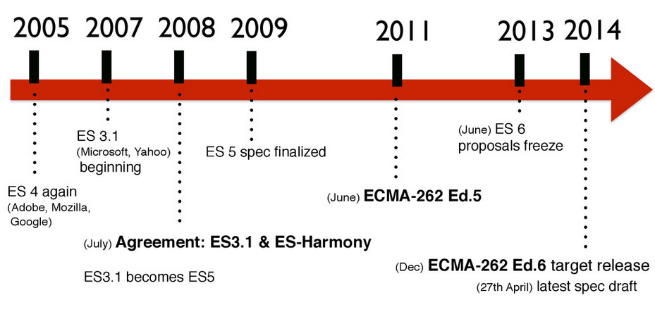

# Ideas Claras de Javascript

* JavaScript es un [lenguaje de programación interpretado](http://es.wikipedia.org/wiki/Lenguaje_de_programaci%C3%B3n_interpretado) por lo que no es necesario compilar los programas para ejecutarlos  

* Según una [separacion en 3 capas de la pagina web](http://titleandsummary.com/separation-of-layers-content-presentation-and-behavior/), con el Javascript controlariamos la capa del comportamiento:  

    * Contenido → HTML  
    * Presentacion → CSS  
    * Comportamiento → Javascript  

    <sub>[http://jeffcroft.com/blog/2007/sep/26/new-layers-web-development/](http://jeffcroft.com/blog/2007/sep/26/new-layers-web-development/)</sub>  

* [Javascript](https://developer.mozilla.org/en/JavaScript_Language_Resources) está basado en [ECMAScript](http://es.wikipedia.org/wiki/ECMAScript) (o Ecma-262) que es una especificación de lenguaje de programacion (otro lenguaje "famoso" basado en este standard es _ActionScript_).  

* Las [diferentes revisiones del Ecma-262](http://www.ecma-international.org/publications/standards/Ecma-262-arch.htm) y su [implementacion en los navegadores](http://kangax.github.io/compat-table/es5/) han ido marcando los desarrollos en Javascript

* Con [la llegada de AJAX](http://www.uberbin.net/archivos/internet/ajax-un-nuevo-acercamiento-a-aplicaciones-web.php) (que no es más que el uso de un objeto javascript con el que podemos interactuar con el servidor sin tener que forzar una recarga de página) se abrió una nueva era en la historia del lenguaje

* El uso tradicional de Javascript ha sido en el browser, pero ya se ha extendido [su uso tambien en el lado del servidor](http://net.tutsplus.com/tutorials/javascript-ajax/learning-serverside-javascript-with-node-js/) ([Node.js](http://nodejs.org/)), en [aplicaciones desktop](https://nodesource.com/blog/node-desktop-applications) y en [aplicaciones mobile](http://phonegap.com/) 

    <sub>[http://www.youtube.com/watch?v=F6k8lTrAE2g](http://www.youtube.com/watch?v=F6k8lTrAE2g)</sub>  
    <sub>[http://clintberry.com/2013/html5-apps-desktop-2013/](http://clintberry.com/2013/html5-apps-desktop-2013/)</sub>  
    <sub>[http://www.hongkiat.com/blog/mobile-frameworks/](http://www.hongkiat.com/blog/mobile-frameworks/)</sub>  

* Hay diferencias entre los navegadores debido al uso de [diferentes motores de Javascript](http://www.etnassoft.com/2011/05/31/comparativa-entre-los-distintos-motores-ecmascript/). Algunos de ellos son:

    * Chrome → V8
    * Firefox 4 → JagerMonkey
    * Opera 10 → Carakan
    * Safari → Nitro
    * Internet Explorer 9 → Chakra

    Aunque la diferencia grande siempre ha estado entre Internet Explorer y el resto (hasta IE9)

* Estos interpretes ([motores](http://en.wikipedia.org/wiki/JavaScript_engine#JavaScript_engines)) de JS que hay en cada navegador, realizan optimizaciones de código cada uno a su manera de ahí el diferente rendimiento entre navegadores

    <sub>[http://jsperf.com/browse](http://jsperf.com/browse)</sub>

* Un [Framework](http://www.desarrolloweb.com/articulos/listado-distintos-framework-javascript.html) (o libreria) es una coleccion de utilidades comunmente utilizadas que pueden ser utilizadas para desarrollar aplicaciones ahorrando tiempo y esfuerzo. El framework mas conocido y utilizado es [jQuery](https://jquery.com/).


# Breve historia de Javascript


- Javascript [fue creado en 10 dias en Mayo de 1995](https://www.w3.org/community/webed/wiki/A_Short_History_of_JavaScript) por [Brendan Eich](http://en.wikipedia.org/wiki/Brendan_Eich), bajo el nombre de Mocha

- La primera version del Javascript aparece en el navegador [Netscape](http://en.wikipedia.org/wiki/Netscape) 2.0  

- En diciembre de 1995 SUN Microsystems y Netscape deciden darle el nombre **JavaScript** (antes se llamó _Mocha_ y _LiveScript_) por una cuestion de puro marketing (_Java_ era el lenguaje más popular por aquellos dias).

- En 1996 Internet Explorer 3.0 incluye una version propia de lo que seria el standard ECMAScript que llama _[JScript](http://en.wikipedia.org/wiki/JScript)_

- En 1997 se propuso este lenguaje como standard y la _European Computer Manufacturers Association_ ([ECMA](http://www.ecma-international.org/default.htm)) lo adopta como tal. De ahí que tambien se le llame **[ECMAScript](http://www.ecma-international.org/publications/standards/Ecma-262.htm)**  

- En Junio de 1997 se publica la [primera edición del ECMA-262](http://www.ecma-international.org/publications/files/ECMA-ST-ARCH/ECMA-262,%201st%20edition,%20June%201997.pdf)

- En [1998](http://www.w3.org/TR/1998/REC-DOM-Level-1-19981001/) y a raiz de las diferencias surgidas entre navegadores, la _W3C (World Wide Web Consortium)_ diseñó el standard **[DOM](http://es.wikipedia.org/wiki/Document_Object_Model)** que es un interfaz (API) para acceder y modificar el contenido estructurado del documento.  

- En [1999](http://www.ecma-international.org/publications/files/ECMA-ST-ARCH/ECMA-262,%203rd%20edition,%20December%201999.pdf), se sientan las bases del Javascript moderno con el lanzamiento de la tercera edición del ECMA-262, tambien llamado **EcmaScript 3**



- En 2005, se acuña el termino [AJAX](http://www.adaptivepath.com/ideas/ajax-new-approach-web-applications/) y revoluciona el mundo del desarrollo web con la llegada de sitios web asíncronos (Gmail, Google Maps...)

-  En [2005](https://jquery.org/history/) sale la primera versión de jQuery. Las diferencias entre navegadores han marcado los desarrollos en Javascript hasta el dia de hoy, y han hecho habitual el uso de [frameworks](http://www.maestrosdelweb.com/editorial/comparacion-frameworks-javascript/) (como jQuery) que nos ayuden a lidiar con estas diferencias.

-  En 2009 se completa y libera la quinta edición del ECMA-262, más conocida como **ECMAScript 5**. La [edicion 5.1](http://www.ecma-international.org/ecma-262/5.1/) se libera en 2011

-  En diciembre de 2014 se aprueba la 6ª edicion del ECMA-262 o **ECMAScript 6**. Se espera el [lanzamiento oficial para Junio de 2015](http://www.2ality.com/2014/06/es6-schedule.html)


#ECMAScript

##EcmaScript 5

**[ECMAScript5.1](http://www.ecma-international.org/ecma-262/5.1/)** fue lanzado en 2011 y podemos decir que [es el actual standard de Javascript](http://blog.oio.de/2013/04/16/ecmascript-5-the-current-javascript-standard/) (2014).  
Esta version **amplia** los anteriores standards [con algunas mejoras](http://www.jayway.com/2011/04/05/what-is-new-in-ecmascript-5/):

- [`strict mode`](https://developer.mozilla.org/en-US/docs/Web/JavaScript/Reference/Strict_mode)

  ```javascript
  function() {
    "use strict";
  }
  ```

  <sub>[http://cjihrig.com/blog/javascripts-strict-mode-and-why-you-should-use-it/](http://cjihrig.com/blog/javascripts-strict-mode-and-why-you-should-use-it/)</sub>
  <sub>[http://www.nczonline.net/blog/2012/03/13/its-time-to-start-using-javascript-strict-mode/](http://www.nczonline.net/blog/2012/03/13/its-time-to-start-using-javascript-strict-mode/)</sub>

- [`Object` new methods](http://ejohn.org/blog/ecmascript-5-objects-and-properties/)

  ```javascript
  // Creates an object with parent as prototype and properties from donor
  Object.create(parent, donor);

  // Meta properties of an object
  var descriptor = {
    value: "test",
    writable: true,    // Can the value be changed?
    enumerable: true,  // Will it appear in for-in and Object.keys(object)?
    configurable: true, // Can the property be removed?
    set: function(value) { test = value}, // Getter
    get: function() { return test }       // Setter
  }

  // Methods for manipulation the descriptors
  Object.defineProperty(object, property, descriptor)
  Object.defineProperties(object, descriptors)
  Object.getOwnPropertyDescriptor(object, property)
  Object.getPrototypeOf(object)

  // Returns an array of enumerable properties
  Object.keys(object)
  // Returns an array of all properties
  Object.getOwnPropertyNames(object)

  // Prevents anyone from adding properties to the object, cannot be undone.
  Object.preventExtensions(object)
  Object.isExtensible(object)

  // Prevents anyone from changing, properties or descriptors of the object.
  // The values can still be changed
  Object.seal(object)
  Objcect.isSealed(object)

  // Prevents any changes to the object.
  Object.freeze(object)
  Object.isFrozen(object)
  ```

- [`Function.prototype.bind()`](https://developer.mozilla.org/en-US/docs/Web/JavaScript/Reference/Global_Objects/Function/bind)

  ```javascript
  var tapir = {
    method: function(name){
      this.name = name;
    }
  };
  setTimeout( tapir.method.bind(tapir, "Malayan"), 100 );
  ```

- [`String.prototype.trim()`](https://developer.mozilla.org/en-US/docs/Web/JavaScript/Reference/Global_Objects/String/Trim)

  ```javascript
  >>> var orig = '   foo  ';
  >>> console.log(orig.trim());
  'foo'
  ```

- [`Array` new methods](http://www.jimmycuadra.com/posts/ecmascript-5-array-methods)

  ```javascript
  // Do all elements satisfy predicate?
  Array.prototype.every(predicate)

  // Return a new array with the elements that satisfy predicate?
  Array.prototype.filter(predicate)

  // Call action(element) for each element.
  Array.prototype.forEach(action)

  // What is the index of the first element that equals value?
  Array.prototype.indexOf(value, fromIndex)

  // What is the index of the last element that equal value?
  Array.prototype.lastIndexOf(value, fromIndex)

  // Create a new array by applying unaryFunc to each element
  Array.prototype.map(unaryFunc)

  // Reduces the elements of the array, by applying binaryFunc
  // between the elements
  // [a0, a1].reduce(+ , seed)  == seed + a0 + a1
  Array.prototype.reduce(binaryFunc, seed)

  // Is at least one element satisfied by the predicate?
  Array.prototype.some(predicate)
  ```

- Native [JSON support](https://developer.mozilla.org/en-US/docs/Web/JavaScript/Guide/Using_native_JSON) with [`JSON.parse()`](https://developer.mozilla.org/en-US/docs/Web/JavaScript/Reference/Global_Objects/JSON/parse) and [`JSON.stringify()`](https://developer.mozilla.org/en-US/docs/Web/JavaScript/Reference/Global_Objects/JSON/stringify) 

Si miramos las [estadisticas de uso de navegadores](http://clicky.com/marketshare/global/web-browsers/versions/) junto con la [compatibilidad de estos con ES5](http://kangax.github.io/compat-table/es5/) podemos concluir que: _basandonos en ES5 nuestro codigo funcionará bien en la mayoria de los navegadores utilizados actualmente (2014)_. 

Si queremos, podemos dar soporte de algunas features de ES5 en navegadores antiguos que no la soporten, utilizando el correspondiente [shim](https://github.com/es-shims/es5-shim)

## EcmaScript 3

[ECMAScript 3](http://www.ecma-international.org/publications/files/ECMA-ST-ARCH/ECMA-262,%203rd%20edition,%20December%201999.pdf) fue lanzado en 2001 y todos los navegadores ([antiguos](http://www.webdevout.net/browser-support-ecmascript) y modernos) siguen este standard.

Añade (respecto del standard anterior): `do-while`, expresiones regulares, nuevos metodos de `string` (`concat`, `match`, `replace`, `slice` , `split` con expresiones regulares, etc.), manejo de excepciones y más. 

## EcmaScript 6

[ECMAScript 6](https://people.mozilla.org/~jorendorff/es6-draft.html) será el proximo standard de Javascript pero [aun no está lo suficientemente implantado](http://kangax.github.io/compat-table/es6/) en los navegadores mas utilizados.

<sub>[https://6to5.org/docs/tour/](https://6to5.org/docs/tour/)</sub>  
<sub>[https://github.com/ericdouglas/ES6-Learning](https://github.com/ericdouglas/ES6-Learning)</sub>  
<sub>[http://es6rocks.com/](http://es6rocks.com/)</sub>  
<sub>[http://code.tutsplus.com/articles/use-ecmascript-6-today--net-31582](http://code.tutsplus.com/articles/use-ecmascript-6-today--net-31582)</sub>  

Aunque podemos dar soporte de estas features de ES6 en navegadores que no las soporten utilizando el correspondiente [shim](https://github.com/paulmillr/es6-shim/)


