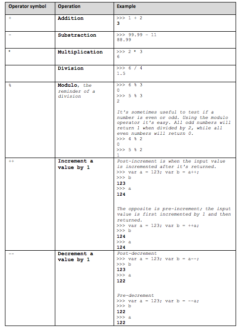
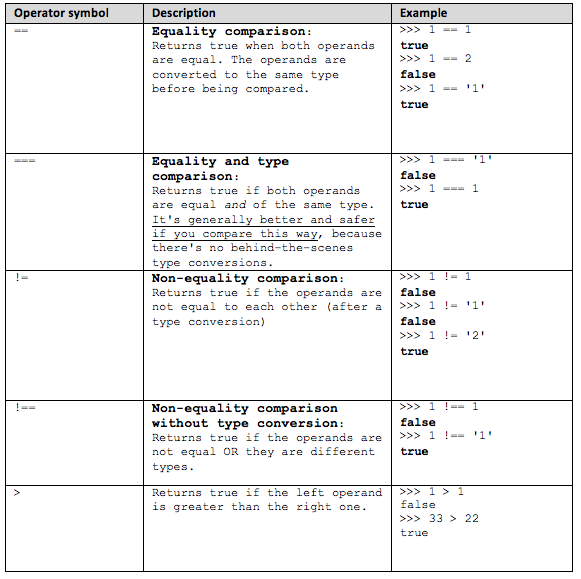

#Variables

- Las Variables se utilizan para almacenar datos

- Las variables solo tienen visibilidad (ambito) dentro de las funciones donde se declaran

- Antes de poder utilizar una variable hay que:
    - Declarar la variable (con la sentencia `var`)
    - Inicializar la variable (en el momento de la declaración o despues)

Ejemplo:
```javascript
var a = 1;
var b;
b = 2;
```
- Las variables son Case Sensitive
Ejemplo:
```javascript
var case_matters = 'lower';
var CASE_MATTERS = 'upper';
case_matters
CASE_MATTERS
```

###¿Cómo chequear la existencia de una variable?
Forma Mala
```javascript
>>> var result = '';
>>> if (somevar){result = 'yes';}
somevar is not defined
>>> result;
""
```
_Genera un warning y que ‘somevar’ devuelva FALSE no quiere decir que no esté definida_

Forma Correcta
```javascript
>>> var somevar;
>>> if (typeof somevar !== "undefined"){result = 'yes';}
>>> result;
""
```
```javascript
>>> somevar = 123;
>>> if (typeof somevar !== "undefined"){result = 'yes';}
>>> result;
"yes"
```

_Si la variable está definida y tiene algún valor, su tipo de datos siempre será distinto de undefined_

#Primitivas y Tipos de Datos
- Cualquier valor que se utilize en JS es de un cierto tipo. En Javascript existen los siguientes tipos de datos primitivos:

    - **Number**: Puede contener numeros enteros (integer), decimales (float), hexadecimales, octales, exponentes y los números especiales NaN y Infinity
    - **String**: Cualquier numero de caracteres entre comillas
    - **Boolean**: puede ser `true` or `false` 
    - **Undefined**: Es un tipo de datos con un solo valor: `undefined`
    Lo devuelve JS cuando no existe una variable o no está inicializada.
    - **Null**: Otro tipo de datos con un solo valor: `null`
    Lo podemos asignar nosotros para inicializar a vacio.
    [http://bonsaiden.github.com/JavaScript-Garden/#core.undefined](http://bonsaiden.github.com/JavaScript-Garden/#core.undefined)

- Cualquier valor que no pertenezca a uno de estos 5 tipo de primitivas es un objeto

- Asi que los tipos de datos en javascript pueden ser:
    - Primitivas (Los 5 tipos)
    - No primitivas (Objetos)

- El operador `typeof` nos devuelve el tipo de dato

Ejemplo:

```javascript
>>> var n = 1;
>>> typeof n;
“number”
>>> var s = "some characters";
>>> typeof s;
"string"
>>> var b = true; typeof b;
"boolean"
```

[http://bonsaiden.github.com/JavaScript-Garden/#types.typeof](http://bonsaiden.github.com/JavaScript-Garden/#types.typeof)

- Existe el valor especial `NaN` (Not a Number) que obtenemos cuando intentamos hacer una operación que asume numeros pero la operación falla.

Ejemplo:
```javascript
>>> var a = 10 * f;
>>> a
NaN
```

#Operadores (Aritméticos, Lógicos y de Comparación)

- Los Operadores toman uno o dos valores (o variables), realizan una operación, y devuelven un valor

- El operador simple de asignación es =

Ejemplo:
```javascript
var a = 1;
```


- Los **OPERADORES ARITMÉTICOS** básicos son:



- Tambien hay operadores compuestos

Ejemplo:
```javascript
>>> var a = 5;
>>> a += 3;
8
```

- Los **OPERADORES LÓGICOS**  son:
    - `!`   → logical NOT (negation) 
    - `&&`  → logical AND 
    - `||`  → logical OR

Ejemplo:
```javascript
>>> var b = !true;
>>> b; 
false
```

- La doble negación nos devuelve el valor original

Ejemplo:
```javascript
>>> var b = !!true;
>>> b; 
true
```

- Las posibles operaciones y sus resultados son:


- Los **OPERADORES DE COMPARACION** son:



#Conversiones 

- Si utilizamos un numero entre comillas (string) en una operación aritmética Javascript lo convierte en numero

Ejemplo:
```javascript
>>> var s = "100"; typeof s; 
"string" 
>>> s = s * 1; 
100 
>>> typeof s; 
"number"
```

- ¡OJO! `undefined` y `null` devuelven cosas diferentes al convertirlas a numero 

Ejemplo:
```javascript
>>> 1*undefined 
NaN
>>> 1*null 
0
```

- Si utilizamos `true` or `false` entre comillas Javascript lo convierte en string

Ejemplo:
```javascript
>>> var b = "true"; typeof b; 
"string"
```
- La doble negación es una forma sencilla de convertir cualquier valor en su Booleano correspondiente. 

    Aplicandolo podemos comprobar como cualquier valor covertido a Booleano es TRUE excepto:

    - `""`
    - `null`
    - `undefined` 
    - `0`
    - `NaN`
    - `false`